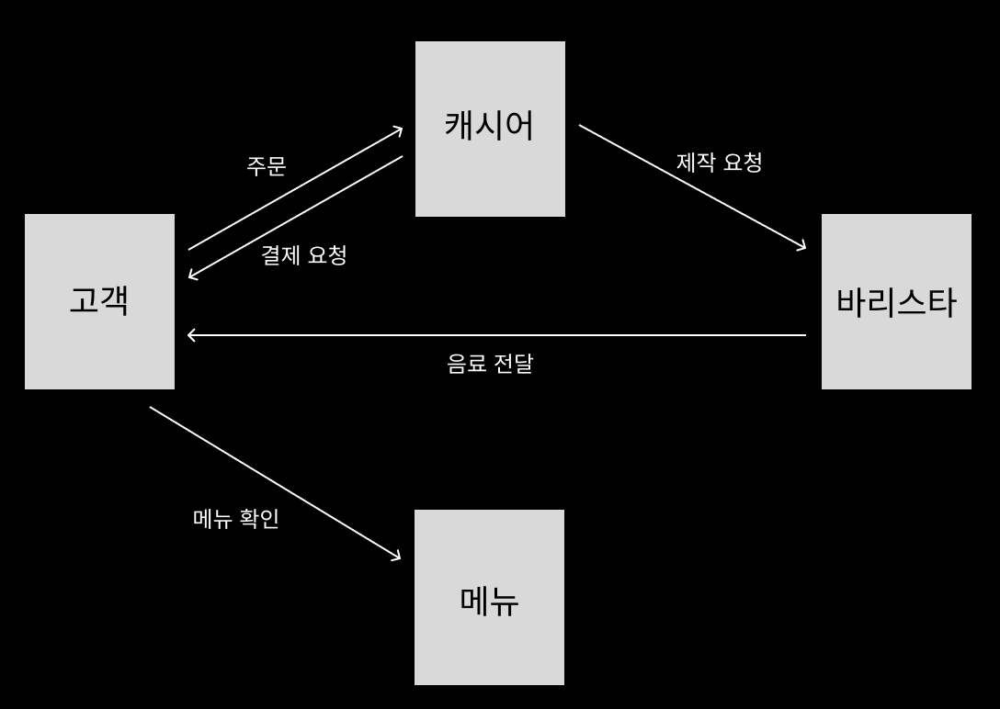

### Cafe Process
- 고객(Customer), 캐시어(Cashier), 바리스타(Barista)가 존재한다.
- 고객은 다수이지만 캐시어와 바리스타는 각각 1명씩 존재한다.
- 메뉴 카테고리는 커피, 티 2가지 종류가 있다.
  - 커피(Hot, Ice): 아메리카노, 카페라떼, 바닐라라떼, 카페모카
  - 티(Hot, Ice): 캐모마일, 얼그레이, 유자차
- 고객은 메뉴를 확인한 후, 한 음료 또는 여러 음료를 주문할 수 있다.
- 캐시어는 고객에게 주문을 받고, 바리스타에게 음료 제작을 요청할 수 있다.
  - 캐시어는 한 명의 고객만 응대할 수 있다. (동시에 여러 고객을 응대할 수 없다.)
  - 음료를 주문 받고 고객에게 결제를 요청한다.
- 캐시어의 결제 요청에 따라 고객은 돈을 지불한다.
- 캐시어의 요청을 받은 바리스타는 음료를 제작한다.
- 음료 제작 후 바리스타는 고객에게 음료를 전달한다.

### 주요 객체
- 메뉴
- 고객
- 캐시어
- 바리스타

### 주요 객체들의 속성과 역할
- 메뉴
  - 커피, 티 2가지 카테고리가 있다.
  - 고객에게 메뉴를 보여준다.
- 고객
  - 메뉴를 확인한다.
  - 캐시어에게 주문할 메뉴를 전달한다.
  - 주문한 메뉴에 대한 돈을 지불한다.
  - 음료를 받는다.
- 캐시어
  - 고객의 주문을 받는다.
  - 고객에게 주문한 메뉴에 대한 결제를 요청한다.
  - 고객에게 돈을 받는다.
  - 바리스타에게 음료 제작을 요청한다.
- 바리스타
  - 캐시어에게 음료 제작 요청을 받는다.
  - 음료를 제작한다.
  - 제작된 음료를 고객에게 전달한다.

### 관계도
